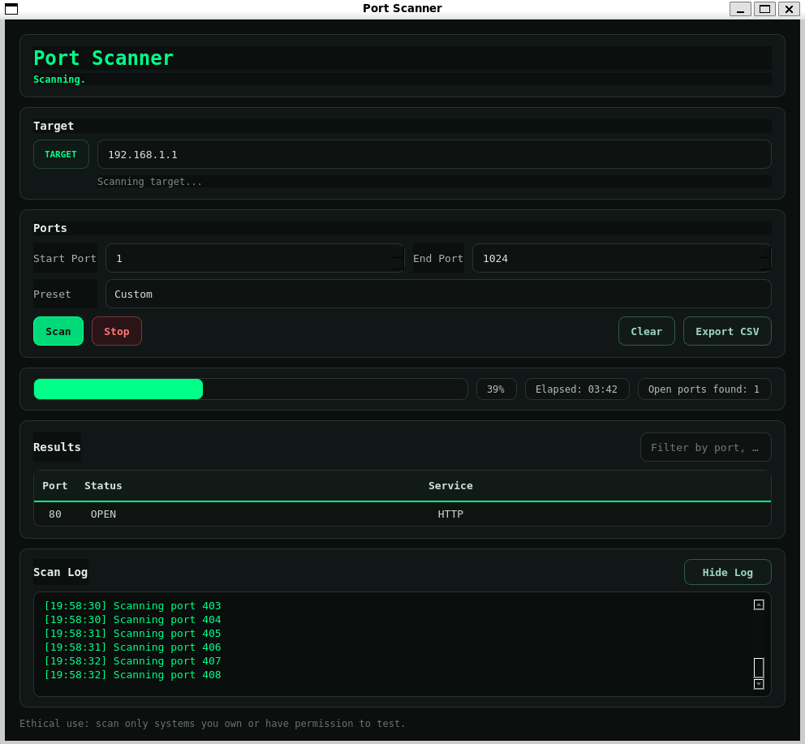
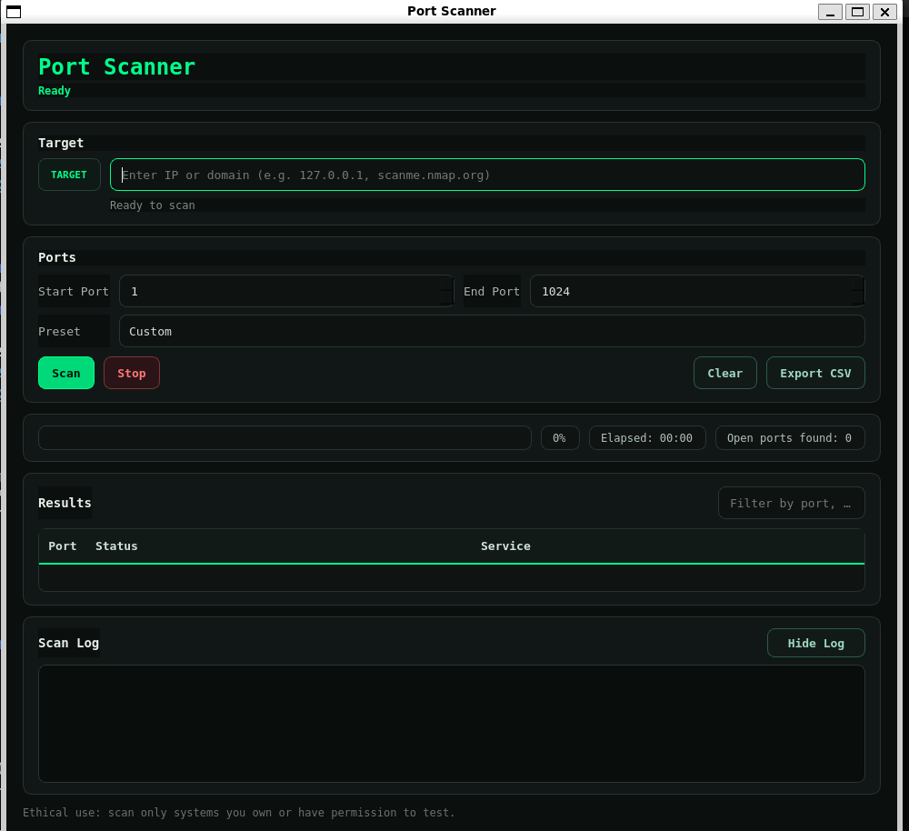

# 🔐 Port Scanner GUI (PyQt5)

A modern, hacker-style **Port Scanner GUI** built with **Python (PyQt5)**.  
Designed for cybersecurity learning, ethical network testing, and portfolio demonstration.

This project provides a clean dark/green terminal-inspired interface with real-time scanning, progress tracking, and CSV export.

---

## ✨ Features

- 🖥️ Modern hacker-style GUI (dark + neon green)
- ⚡ Fast TCP port scanning
- 📊 Real-time progress bar and elapsed time
- 🟢 Open port counter
- 🧵 Background scanning using threads (UI remains responsive)
- 📁 Export scan results to CSV
- 🔍 Service name detection (common ports)
- 🛑 Start / Stop scan control
- 🧹 Clear results instantly
- ⚠️ Ethical use disclaimer built into UI

---

## 🖼️ Screenshots

> Add your screenshots here after uploading them to the `screenshots/` folder.

```text
screenshots/
 ├── main-ui.png
 └── scanning.png
## 🖼️ Screenshots


## 🖼️ Screenshots



